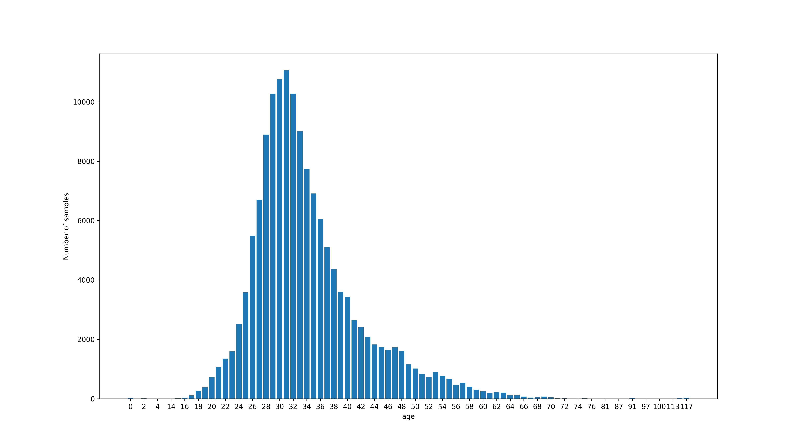
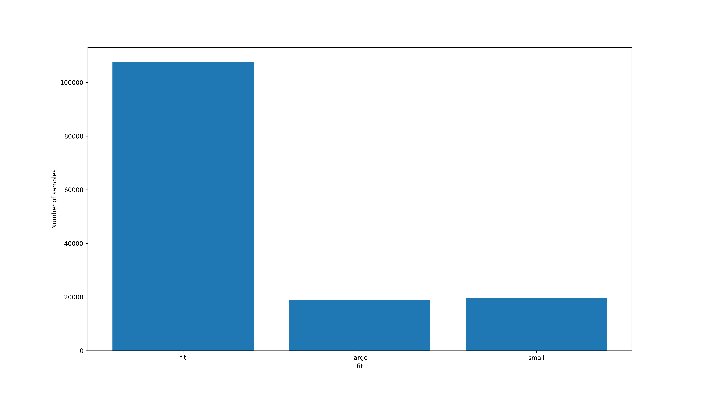
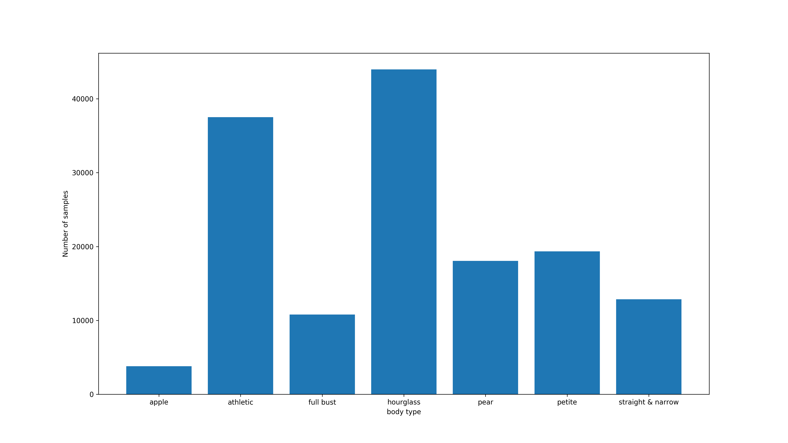
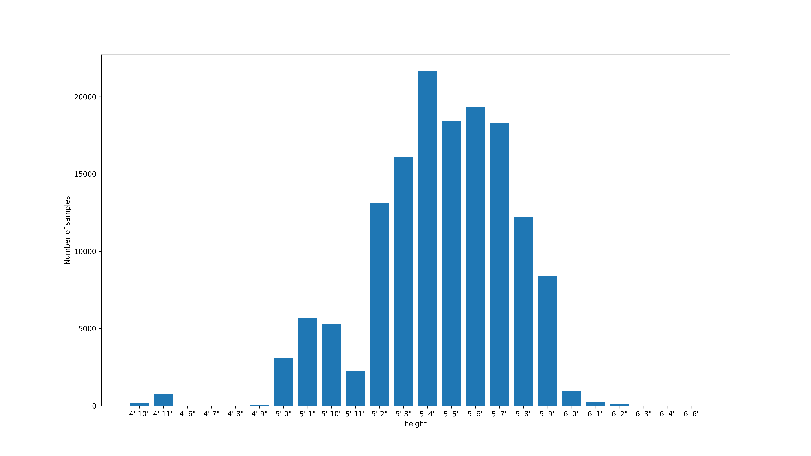
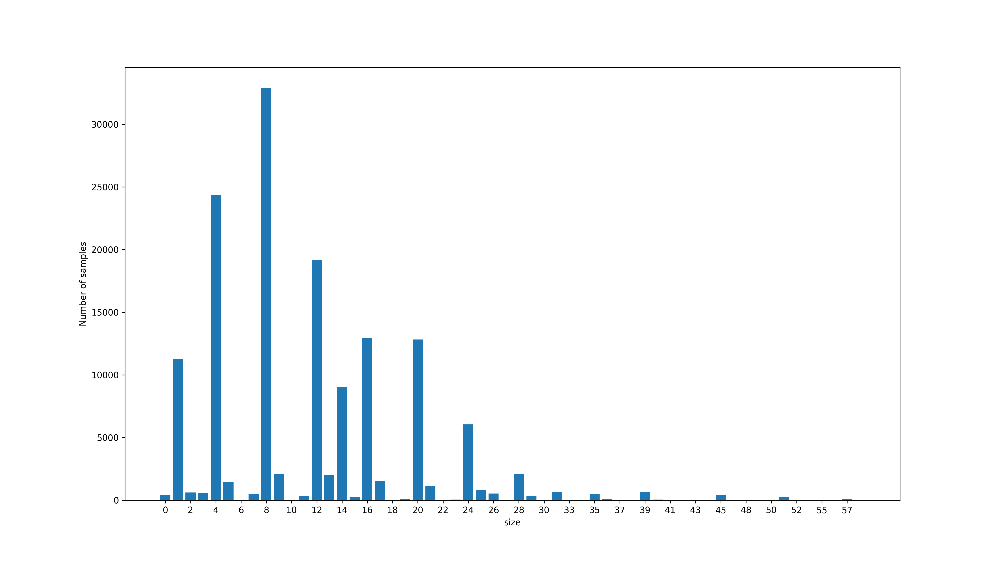
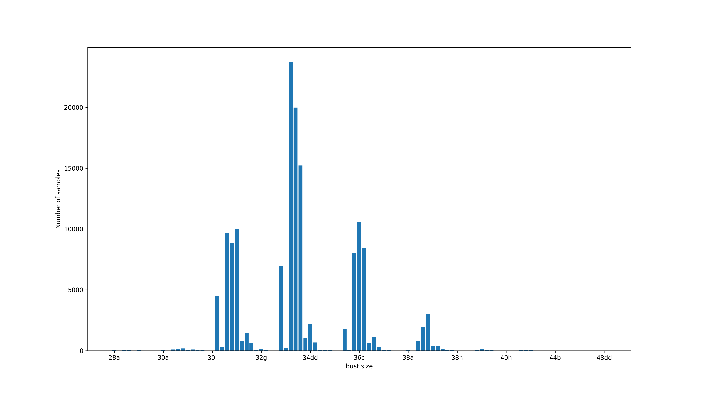
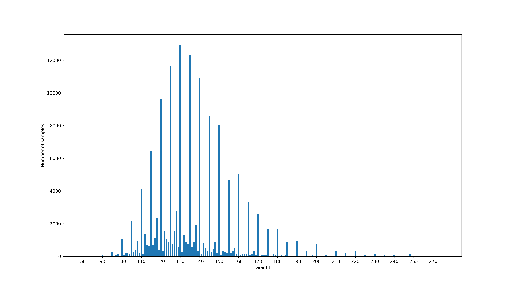

# PA2

## Statistics of clothing dataset

Distribution of users' age

Distribution of fit

Distribution of rent purpose

Distribution of body type

Distribution of heigh

Distribution of size

Distribution of bust size

Distribution of rating

Distribution of weight

